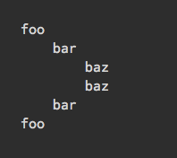

# lpad

> Left-pad each line in a string



## Install

```
$ npm install lpad
```

## Usage

```js
import leftPad from 'lpad';

const string = 'foo\nbar';
/*
foo
bar
*/

lpad(string, '    ');
/*
    foo
    bar
*/
```

## API

### lpad(string, padString)

Pads each line in a string with the supplied string.

#### string

Type: `string`

String that will be padded.

#### padString

Type: `string`

String that will be prepended to each line.
